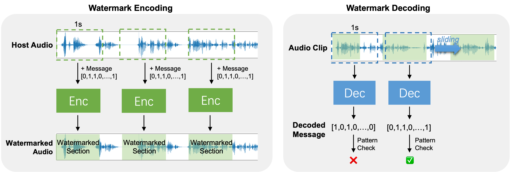

# WavMark
> AI-based Audio Watermarking Tool

- ⚡  **Leading Stability:** The watermark resist to **10**  types of common attacks like Gaussian noise, MP3 compression, high-pass filter, and speed variation; achieving over **29** times in robustness compared with the traditional method.
- 🙉 **High Imperceptibility:** The watermarked audio has over 38dB SNR and 4.3 PESQ, which means it is inaudible to humans. Listen to our demo: [https://wavmark.github.io/](https://wavmark.github.io/).
- 😉 **Easy for Extending:** This project is entirely python based. You can easily leverage our underlying PyTorch model to implement a custom watermarking system with higher capacity and robustness.

## Basic Usage
The following code adds 16-bit watermark into the input file `example.wav` and subsequently performs decoding:
```python
import numpy as np
import soundfile
import torch
import wavmark


# 1.load model
device = torch.device('cuda:0' if torch.cuda.is_available() else 'cpu')
model = wavmark.load_model().to(device)

# 2.create 16-bit payload
payload = np.random.choice([0, 1], size=16)
print("Payload:", payload)

# 3.read host audio
# the audio should be a single-channel 16kHz wav, you can read it using soundfile:
signal, sample_rate = soundfile.read("example.wav")
# Otherwise, you can use the following function to convert the host audio to single-channel 16kHz format:
# from wavmark.utils import file_reader
# signal = file_reader.read_as_single_channel("example.wav", aim_sr=16000)

# 4.encode watermark
watermarked_signal, _ = wavmark.encode_watermark(model, signal, payload, show_progress=True)
# you can save it as a new wav:
# soundfile.write("output.wav", watermarked_signal, 16000)

# 5.decode watermark
payload_decoded, _ = wavmark.decode_watermark(model, watermarked_signal, show_progress=True)
BER = 100 * (1 - (payload == payload_decoded).mean())

print("Decode BER:%.1f" % BER)
```


## How it works?
In paper [WavMark: Watermarking for Audio Generation](https://arxiv.org/pdf/2308.12770.pdf) we proposed the WavMark model,
which enables encoding 32 bits of information into 1-second audio.
In this tool, we take the first 16 bits as a fixed pattern for watermark identification and the remaining 16 bits as a custom payload.
The watermark is added  iteratively into the host to ensure full-time region protection:


Since the pattern length is 16, the probability of "mistakenly identifying an unwatermarked audio as watermarked" is only  `1/(2^16)=0.000015`.


## Thanks
The "[Audiowmark](https://uplex.de/audiowmark)" developed by Stefan Westerfeld has provided valuable ideas for the design of this project.
## Citation
```
@misc{chen2023wavmark,
      title={WavMark: Watermarking for Audio Generation}, 
      author={Guangyu Chen and Yu Wu and Shujie Liu and Tao Liu and Xiaoyong Du and Furu Wei},
      year={2023},
      eprint={2308.12770},
      archivePrefix={arXiv},
      primaryClass={cs.SD}
}
```